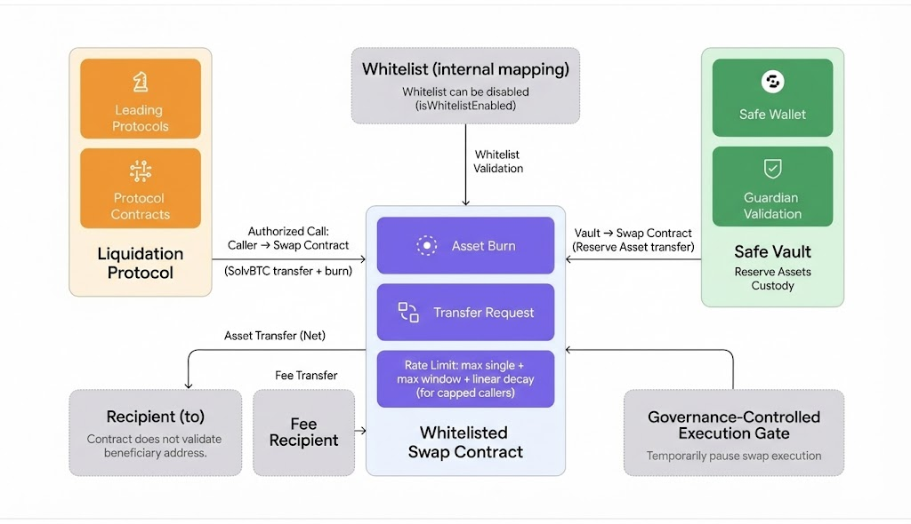

# SolvBTC Whitelisted Swap

### 1. Overview

The **SolvBTC Whitelisted Swap** contract provides a single-transaction on-chain path for authorized callers to convert **SolvBTC** into the underlying **Reserve Asset (currency)**.

It is intended for protocol-level execution flows (e.g., liquidation, treasury execution, or integrated adapters) rather than a general user redemption mechanism.

***

### 2. Scope and Usage Context

Whitelisted Swap is designed for **integrated protocols and authorized operators**, including:

* Lending protocols
* Liquidation engines
* Protocol-controlled executors
* Designated on-chain adapters

Access can be enforced via a whitelist. When whitelist checks are disabled, any caller can execute swaps, and the same limits apply to all callers.

#### 2.1  Architecture Overview 

The diagram below provides a structural view of the Whitelisted Swap model, showing the execution contract, whitelist boundary, vault funding path, and fee routing.

It is intended to describe contract relationships and authorization boundaries rather than a step-by-step execution sequence.

<figure></figure>

***

### 3. Whitelisted Swap Contract

The **SolvBTCWhitelistedSwap** contract is the execution contract responsible for converting SolvBTC into the Reserve Asset.

Key responsibilities include:

* Receiving swap execution calls from authorized callers
* Enforcing whitelist eligibility and optional rate limits
* Burning the specified amount of SolvBTC
* Pulling Reserve Assets from the currency vault using a pre-approved allowance
* Delivering net Reserve Assets to the recipient
* Calculating and routing swap fees to a fee recipient

The contract:

* Does not custody Reserve Assets long term
* Does not perform pricing or market making
* Uses a deterministic conversion based on SolvBTC and Reserve Asset decimals
* Is protected by `ReentrancyGuard` and `Pausable` controls

***

### 4. Whitelist and Rate Limit Model

The **Whitelist** is a per-address access registry used by the swap contract. Each whitelist entry includes:

* `expiration`: the timestamp after which the entry becomes invalid
* `isRateLimited`: whether the address is subject to the shared rate limit

Whitelisted addresses fall into two categories:

* **Uncapped addresses**: authorized without rate limits
* **Capped addresses**: share a **global rate limit** enforced by the contract

When whitelist enforcement is enabled, a caller must have a valid (non-expired) whitelist entry. If whitelist enforcement is disabled, no whitelist checks or rate limits are applied.

**Global rate limit model (for capped addresses):**

* **Max single swap amount**: a per-transaction cap
* **Max window swap amount**: a rolling window cap shared by all capped addresses
* **Linear decay**: the in-flight window usage decays linearly with time to replenish capacity

A helper function exposes remaining capacity so integrators can query available swap headroom before execution.

***

### 5. Safe Vault Interaction

The Whitelisted Swap contract does not hold Reserve Assets. Instead, it pulls funds from the **currency vault** during execution.

To support atomic swaps:

* Governance grants the swap contract an allowance on the Reserve Asset
* The contract checks both **vault balance** and **allowance** before pulling funds
* Reserve Assets are transferred directly from the vault to the swap contract, then forwarded to recipients

This design ensures the swap contract only accesses funds through controlled vault allowances.

***

### 6. Execution Flow

A whitelisted swap is executed as a single on-chain transaction.

**Execution sequence:**

1. An authorized address calls `swap(to, amount)`
2. If whitelist is enabled, the caller is validated and (if capped) rate limits are enforced
3. SolvBTC is transferred from the caller and burned
4. The equivalent Reserve Asset amount is calculated based on token decimals
5. The vault balance and allowance are checked
6. Reserve Asset is pulled from the vault
7. A swap fee is calculated and routed to the fee recipient
8. The net Reserve Asset amount is delivered to `to`
9. `SolvBTCSwapped` is emitted

***

### 7. Integration Pattern for Liquidation Protocols

In a typical liquidation flow within a lending protocol:

1. A borrower becomes undercollateralized
2. The protocol seizes SolvBTC collateral
3. The protocol invokes the Whitelisted Swap contract
4. SolvBTC is converted into the Reserve Asset
5. The Reserve Asset is used to settle outstanding debt

The Whitelisted Swap contract serves as an **execution step** within the liquidation transaction.

***

### 8. Governance and Authorization

Governance manages all business parameters and emergency controls:

* Managing whitelist membership and expiration
* Configuring the Reserve Asset, vault, fee recipient, and fee rate
* Setting per-transaction and window-based swap limits
* Enabling or disabling whitelist enforcement
* Pausing or unpausing swap execution

Governance does not participate in individual swap execution. The pause mechanism serves as an execution gate for emergency suspension without modifying configuration state.

***

### 9. Observability and Events

Key events emitted by the contract include:

* `SolvBTCSwapped`: swap execution details (caller, recipient, amounts, fee)
* `SetWhitelistConfig`: whitelist updates for an address
* `SetMaxWindowSwapAmount`: global rate limit changes
* `SetMaxSingleSwapAmount`: per-transaction limit changes
* `SetFeeRate` / `SetFeeRecipient`: fee configuration updates
* `SetCurrency` / `SetCurrencyVault` / `SetSolvBTC`: core contract wiring updates

These events allow off-chain indexers and monitoring systems to track configuration and execution state changes.
